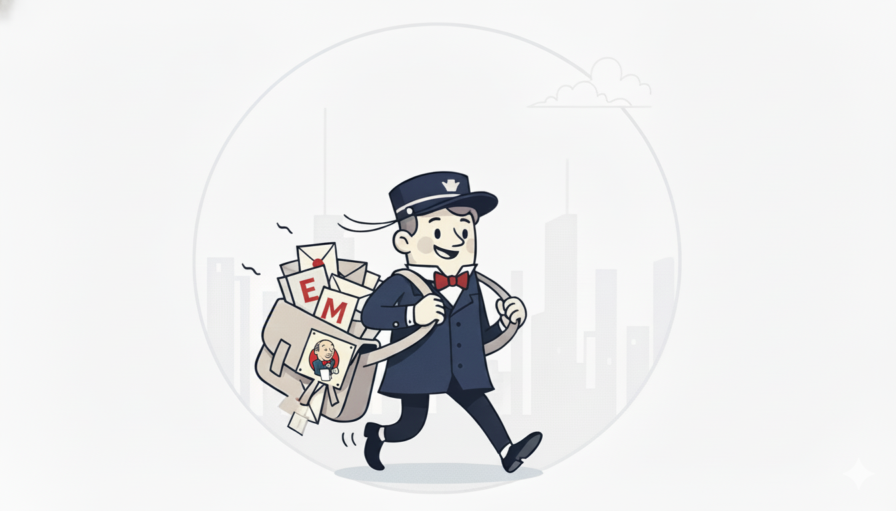

<div align="center">
  
</div>
---

# Notification Service

A decoupled, extensible Python service for sending rich-text emails and attachments by leveraging a Jenkins backend. This service acts as an abstraction layer, providing a simple API for applications to send notifications without needing direct access to SMTP credentials or email-sending logic.

## Table of Contents

- [Architectural Overview](#architectural-overview)
- [Key Features](#key-features)
- [Prerequisites](#prerequisites)
- [Setup and Installation](#setup-and-installation)
  - [Part 1: Jenkins Configuration](#part-1-jenkins-configuration)
  - [Part 2: Python Application Setup](#part-2-python-application-setup)
- [Configuration](#configuration)
- [Usage Example](#usage-example)
- [Advanced: Extending the Service](#advanced-extending-the-service)
- [Troubleshooting](#troubleshooting)
- [License](#license)

## Architectural Overview

This service is designed with a clear separation of concerns, treating Jenkins as a secure "worker" for dispatching emails. This decoupled architecture ensures that the main application is not tied to a specific notification implementation.

```
+--------------------------+        +--------------------------+        +--------------------------+
|                          |        |    Notification Service  |        |                          |
|   Consumer Application   |------> |      (Python Module)     |------> |    Jenkins Email Job     |
| (e.g., your main script) |        |                          |        |      (The "Worker")      |
|                          |        |  [ Client -> Backend ]   |        |                          |
+--------------------------+        +--------------------------+        +--------------------------+
           |                                     |                                   |
    - Knows what to send.                 - Knows HOW to send.                - Knows only the final
    - Calls NotificationClient.send()       - Manages config & credentials.       delivery mechanism (SMTP).
    - Is completely unaware of Jenkins.     - Abstracted via a backend pattern.
```

## Key Features

-   **Decoupled Architecture**: Your application uses a simple Python client and has no knowledge of the underlying Jenkins backend.
-   **Centralized & Secure Configuration**: All SMTP server details and credentials are stored securely within Jenkins, not in the Python application's code or configuration.
-   **Scalable & Concurrent**: By offloading email dispatch to Jenkins, the service can handle multiple concurrent requests. Jenkins's build queue manages the load gracefully.
-   **Robust and Reliable**: Guarantees that every request generates a new email by using a unique build identifier to prevent Jenkins's build coalescing feature.
-   **Rich Content**: Supports HTML-formatted email bodies and file attachments out of the box.
-   **Extensible**: The backend is implemented using a Strategy Pattern, allowing you to easily add new backends (e.g., for AWS SES, SendGrid) without changing the client-facing code.
-   **Configurable Proxy Support**: Can be configured to bypass system-level HTTP proxies, which is essential for internal network communication.

## Prerequisites

-   Python 3.8+
-   `pip` for installing packages
-   A running Jenkins instance (v2.346+ recommended) with network access from the machine running the Python script.

## Setup and Installation

Setup involves two main parts: configuring the worker job in Jenkins and setting up the Python service.

### Part 1: Jenkins Configuration

1.  **Install Jenkins Plugin**:
    -   In Jenkins, go to `Manage Jenkins` -> `Manage Plugins`.
    -   On the `Available` tab, search for and install the **Email Extension Plugin**.
    -   Restart Jenkins if required.

2.  **Configure Jenkins Mailer**:
    -   Go to `Manage Jenkins` -> `Configure System`.
    -   Configure the **Extended E-mail Notification** section with your SMTP server details, port, and credentials. It's highly recommended to use an app password or service account.

3.  **Create the Jenkins Job**:
    -   Create a new **Freestyle project** and name it (e.g., `my_notification_service`).
    -   In the **General** section, check **This project is parameterized**.
    -   Add the following parameters by clicking **Add Parameter**:
        -   `String Parameter` -> Name: `RECIPIENTS`
        -   `String Parameter` -> Name: `SUBJECT`
        -   `Text Parameter` -> Name: `BODY`
        -   `String Parameter` -> Name: `CONTENT_TYPE` (Default Value: `text/html`)
        -   `File Parameter` -> Location: `ATTACHMENT_FILE`
        -   `String Parameter` -> Name: `BUILD_UUID` (Description: `Unique ID to prevent build coalescing.`)

4.  **Enable Remote Triggering**:
    -   In the **Build Triggers** section, check **Trigger builds remotely (e.g., from scripts)**.
    -   In **Authentication Token**, enter a long, secret, random string. This will be your `JENKINS_BUILD_TOKEN`.

5.  **Configure Post-build Action**:
    -   At the bottom, click **Add post-build action** and select **Editable Email Notification**.
    -   Click **Advanced Settings...**.
    -   Fill in the fields using the parameters you defined:
        -   **Project Recipient List**: `$RECIPIENTS`
        -   **Default Subject**: `$SUBJECT`
        -   **Default Content**: `$BODY`
        -   **Content Type**: `HTML (text/html)`
        -   **Attachments**: `ATTACHMENT_FILE`
    -   Add a **Trigger** (e.g., "Always") to ensure the email is sent every time.
    -   **Save** the job.

### Part 2: Python Application Setup

1.  **Clone the Repository** (or integrate the `notification_service` directory into your project).

2.  **Create a Virtual Environment** (Recommended):
    ```bash
    python -m venv venv
    source venv/bin/activate  # On Windows: venv\Scripts\activate
    ```

3.  **Install Dependencies**:
    ```bash
    pip install -r requirements.txt
    ```

4.  **Create Configuration File**:
    -   Create a file named `.env` in the root of your project.
    -   Copy the contents from the template below and fill in your details.

## Configuration

The service is configured using environment variables defined in a `.env` file.

**`.env` file template:**

```ini
# .env
# --- Jenkins Connection Details ---
# The base URL of your Jenkins instance
JENKINS_URL="http://your-jenkins-host:8080"

# The username of a Jenkins user with Job/Build permissions
JENKINS_USER="your_jenkins_username"

# A personal API token for the user, NOT their password.
# Generate this from the user's "Configure" page in Jenkins.
JENKINS_API_TOKEN="your_jenkins_api_token"

# --- Jenkins Job Specifics ---
# The exact name of the Freestyle project you created
JENKINS_JOB_NAME="your_jenkins_job_name"

# The secret token configured in the "Trigger builds remotely" section of the job
JENKINS_BUILD_TOKEN="YOUR_SECRET_JOB_TRIGGER_TOKEN"

# --- Network Configuration ---
# Set to "true" to bypass any system-level HTTP proxies when connecting to Jenkins.
# This is useful if Jenkins is on an internal network.
BYPASS_PROXY_FOR_JENKINS="true"
```

## Usage Example

The following example shows how to import and use the `NotificationClient` to send an email with an HTML body and an attachment.

```python
# main.py
import os
from notification_service import NotificationClient, EmailRequest, BackendError

def create_dummy_attachment(filename="report.txt"):
    """Creates a simple file to use as an attachment."""
    with open(filename, "w") as f:
        f.write("This is a test report.\n")
    return os.path.abspath(filename)

if __name__ == "__main__":
    # 1. Initialize the notification client. It automatically reads from .env.
    client = NotificationClient()

    # 2. Create a dummy file to attach.
    attachment_path = create_dummy_attachment()
    
    # 3. Prepare the email content dynamically.
    html_body = """
    <html>
    <body>
        <h1>Project Alpha - Build Report</h1>
        <p>The scheduled build has completed successfully.</p>
        <p>Please find the detailed results in the attached report.</p>
        <p><b>Status:</b> <span style='color:green;'>SUCCESS</span></p>
    </body>
    </html>
    """

    # 4. Create an EmailRequest object with all necessary details.
    email = EmailRequest(
        to_recipients=["team-lead@example.com", "manager@example.com"],
        cc_recipients=["qa-team@example.com"],
        subject="Project Alpha - Nightly Build Report",
        body=html_body,
        attachment_path=attachment_path
    )

    # 5. Send the email using a try/except block for robust error handling.
    try:
        print("Attempting to send email via Notification Service...")
        client.send_email(email)
        print("--- Email dispatch command sent successfully! ---")
    except BackendError as e:
        print(f"\nERROR: Failed to send notification.")
        print(f"Reason: {e}")
        # Add fallback logic here (e.g., log to a file).
    finally:
        # Clean up the dummy file.
        os.remove(attachment_path)
```

## Advanced: Extending the Service

The architecture makes it easy to add new notification backends. To add a backend for another service (e.g., SendGrid):

1.  Create a new file: `notification_service/backends/sendgrid_backend.py`.
2.  In that file, create a class `SendGridBackend` that inherits from `BaseBackend`.
3.  Implement the abstract `send(self, email_request: EmailRequest)` method with the logic to call the SendGrid API.
4.  In your main application, you can now instantiate the client with your new backend:
    ```python
    from notification_service.backends.sendgrid_backend import SendGridBackend

    sendgrid_backend = SendGridBackend(settings)
    client = NotificationClient(backend=sendgrid_backend)
    client.send_email(email)
    ```

## Troubleshooting

-   **Q: I'm getting a `403 Client Error: Forbidden`!**
    -   **A1: Check your API Token.** Ensure `JENKINS_API_TOKEN` in your `.env` file is a **generated API token** and NOT the user's password.
    -   **A2: Check User Permissions.** The `JENKINS_USER` must have `Job -> Build` permissions for the Jenkins job.
    -   **A3: Check Proxy Settings.** If you are behind a corporate proxy, ensure `BYPASS_PROXY_FOR_JENKINS` is set to `true` if Jenkins is on your local network.

-   **Q: Why aren't all my emails sending when I send them quickly?**
    -   **A:** This is due to Jenkins's **build coalescing** feature. The service solves this by sending a unique `BUILD_UUID` with every request. Ensure you have added this parameter to your Jenkins job as described in the setup instructions.

-   **Q: I'm getting a `414 Client Error: URI Too Long`!**
    -   **A:** This happens when the email body is too large to fit in a URL. The current version of this service is designed to prevent this by sending all large data (like the email body) in the `POST` request body, not in the URL parameters. If you encounter this, ensure your code matches the latest version.

## License

This project is licensed under the MIT License.